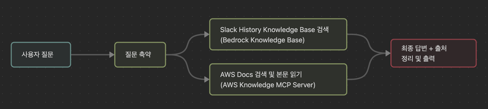
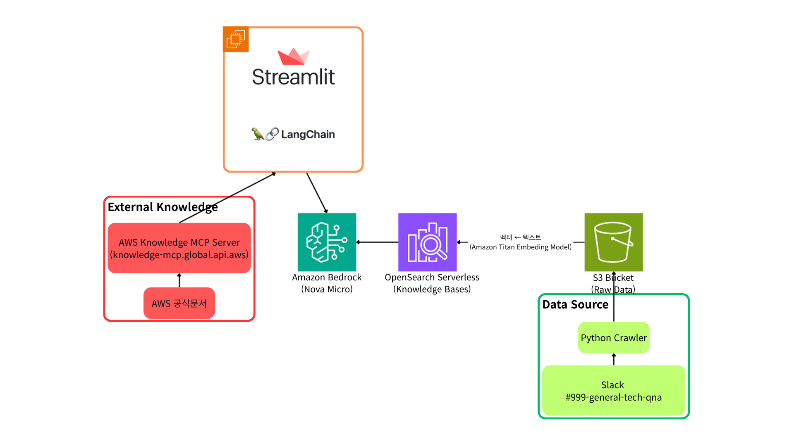

# NxtCloud AI 과제 - 공통과제

### 오지라퍼 - Slack 데이터 + AWS 공식 문서를 활용한 Q&A 챗봇 
### [데모 웹](http://43.203.147.152:8501/)

---

> 오지라퍼는 사용자의 질문에 **start-aws 슬랙 워크스페이스의 #999-general-tech-qna 채널의 히스토리 데이터**와 **AWS 공식 문서(MCP 서버 사용)**를 기반으로 답변하는 챗봇입니다.

## 데이터 소스
- **슬랙 데이터(RAG)**  
  NxtCloud에서 진행하는 교육/대회 운영 특성(예: **Access Key 발급 불가**, **Route53 사용 불가**, **리전 제한** 등)처럼 **공식 문서만으로 담기 어려운 제약사항과 맥락**이 슬랙 #999-general-tech-qna 채널에 축적되어 있습니다.  
  오지라퍼는 이 히스토리를 RAG로 검색하여 답변을 제시합니다.

- **AWS 공식 문서 (MCP)**  
  [AWS Documentation MCP 서버](https://awslabs.github.io/mcp/servers/aws-documentation-mcp-server/)를 사용해 공식 문서를 **검색->본문 취득**하고, Slack Knowledge Base 결과와 함께 근거로 통합합니다.

  답변의 하단부에는 답변 생성에 참고한 **슬랙 스레드 링크와** **공식 문서 링크**를 함께 제공합니다.

---

## 구성한 체인



---

## 아키텍처



---

### 디렉토리 구조

```
.
├── app/
│ ├── main.py # Streamlit
│ ├── chain.py # Langchain 관련
│ └── .env.example # 프론트(streamlit)에 필요한 환경변수
├── crawler/
│ ├── crawler.py # Slack 데이터 크롤러
│ └── .env.example # 크롤링에 필요한 환경변수
├── infra/
│ ├── main.tf # S3, OpenSearch, Knowledge Base 리소스 및 관련 권한 정의
│ └── variables.tf # 필요한 변수
└── README.md

```

---

## 실행 순서(각 디렉토리 내에 Readme.md도 참고 해주세요)
1. infra의 테라폼 코드로 먼저 인프라를 생성해주세요.
2. 크롤러를 통해 데이터를 크롤링 하여, S3에 저장합니다.
3. awscli를 통해 크롤링 된 데이터를 opensearch에 Ingest 합니다.
2. 그 후 생성된 인프라의 아웃풋(KB ID 등)을 환경변수로 설정하여 streamlit 앱을 실행해주세요!

---
## Nova Micro를 사용한 이유

본 프로젝트에서는 Amazon Bedrock의 **Nova Micro**를 메인 모델로 사용했습니다. 그 이유는 다음과 같습니다.

1. 오지라퍼가 다루는 질문은 대부분 짧고 구체적인 기술 질의입니다. 긴 창의적 서술보다는 정확한 사실 추출과 짧은 요약이 중요하므로, 경량 모델이 더 적합하다고 생각했습니다.
2. Nova Micro는 저렴하고 빠른 속도를 가지고 있습니다.
3. 사용되는 컨텍스트의 길이가 Nova Micro에서 제공하는 컨텍스트 크기(128k)로도 충분하다고 생각했습니다.

---

## 추후 개선 방향

1. 플랫폼
   현재는 streamlit 기반이나, Slack Bot으로 서비스 시에 효과가 더 좋을 것 같습니다. 예를 들어, 사용자가 qna 채널에 질문을 게시하면, 멘토들이 이에 대해 답변하기 전에, 이전에 나왔던 비슷한 질문에 대한 답변 및 AWS 공식 독스 기반으로 먼저 답변을 해줄 수 있다면, 사용자는 빠르게 문제를 해결할 수 있을 것입니다.
2. 자동화
   현재는 크롤링 및 ingest 과정이 스크립트 혹은 AWS CLI를 사용하여 수동으로 진행됩니다. qna 채널에 새로운 질문 및 답변이 등록되면, 이를 주기적으로 가져와 ingest 하는 파이프라인을 구성해야 합니다.
3. 성능
   아직까지 검색 결과가 좋은 편이 아닙니다. 이를 조금 더 보완해보고 싶습니다.
