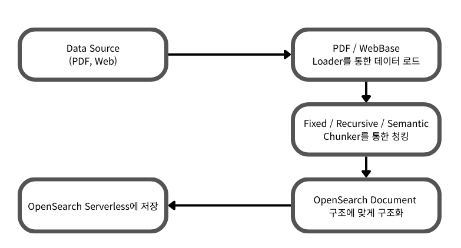

# NxtCloud AI 과제 - 데이터 엔지니어링

### 데이터 파이프라인 - PDF/Web 데이터 처리 및 검색 시스템
### [데모 웹](http://43.203.147.152:8502/)

---

> PDF 및 Web 문서로부터 데이터를 수집하여 Amazon OpenSearch Serverless에 저장하고, 이를 기반으로 문서 검색을 제공하는 데이터 엔지니어링 프로젝트입니다.

## 주요 기능

- PDF 파일 및 웹페이지 콘텐츠 로드
- 텍스트 정규화, 테이블을 마크다운으로 변환, 3가지 청킹 방법
- 고급 임베딩: Amazon Bedrock Titan 모델을 통한 의미론적 벡터화
- 벡터 검색과 키워드 검색을 결합한 하이브리드 검색

---

## 데이터 파이프라인 아키텍처



### 파이프라인 구성 요소

1. 데이터 로더 (Loaders)
   - PDFLoader: PDF 문서 텍스트 추출 및 메타데이터 처리
   - WebBaseLoader: 웹페이지 콘텐츠 크롤링 및 HTML 파싱

2. 데이터 정제 (Cleaning)
   - TextNormalizer: 텍스트 정규화 및 불필요한 문자 제거
   - TableToMarkdown: HTML 테이블을 마크다운 형식으로 변환

3. 문서 분할 (Chunking)
   - FixedChunker: 고정 크기 기반 분할
   - RecursiveChunker: 재귀적 문서 구조 기반 분할
   - SemanticChunker: 의미론적 유사성 기반 분할(임베딩 모델 사용)

4. 구조화 (Structuring)
   - 메타데이터 추출 및 문서 구조 정의
   - 검색 최적화를 위한 필드 매핑

5. 벡터 저장소 (Vector Store)
   - Amazon OpenSearch Serverless 컬렉션
   - 하이브리드 검색 (벡터 + 키워드) 지원

---

## 프로젝트 구조

```
2-data-engineering/
├── app/
│   └── main.py                    # Streamlit 웹 애플리케이션
├── src/
│   ├── loader/
│   │   ├── pdf_loader.py          # PDF 문서 로더
│   │   └── webbase_loader.py      # 웹페이지 로더
│   ├── cleaning/
│   │   ├── text_normalize.py      # 텍스트 정규화
│   │   └── table_to_markdown.py   # 테이블 변환
│   ├── chunker/
│   │   ├── fixed_chunker.py       # 고정 크기 분할
│   │   ├── recursive_chunker.py   # 재귀적 분할
│   │   └── semantic_chunker.py    # 의미론적 분할
│   ├── structuring/
│   │   └── structurer.py          # 문서 구조화
│   ├── embedding/
│   │   └── embedder.py            # embedder 클래스
│   ├── pipeline/
│   │   └── pipeline.py            # 메인 파이프라인
│   └── tests/                     # 초반에 사용했던 테스트
│       ├── test_pdf_loader.py     # PDF 로더 테스트
│       └── test_web_loader.py     # 웹 로더 테스트
├── infra/
│   ├── main.tf                    # 메인 리소스
│   ├── variables.tf               # 변수
│   ├── outputs.tf                 # 출력값
│   └── providers.tf               # 프로바이더
├── pyproject.toml                 # Python 프로젝트 설정
├── uv.lock                        # 의존성 잠금 파일
└── README.md
```

---

## 실행 방법

#### 1. 인프라 배포 (Terraform)
AWS OpenSearch Serverless 등 필요한 인프라를 배포합니다.

```bash
# infra 디렉토리로 이동
cd infra

# Terraform 초기화 및 배포
terraform init
terraform apply
```

배포가 완료되면 `terraform output`으로 OpenSearch 엔드포인트를 확인하고, 이 값을 다음 단계에서 사용합니다.

#### 2. Streamlit 데모 앱 실행
데이터 처리 및 검색을 위한 데모 웹 앱을 실행합니다.

```bash
# 프로젝트 루트 디렉토리로 이동
cd .. 

# 가상환경 생성 및 활성화
uv venv --python 3.12
source .venv/bin/activate

# 의존성 설치
uv sync

# 환경 변수 설정
cp .env.example .env
# -> .env.dev 파일을 열어 terraform output 값을 참고하여 변수를 채워주세요.

# Streamlit 앱 실행
uv run streamlit run app/main.py
```

---

## 환경 변수
다음 환경 변수들을 `.env` 파일에 설정해야 합니다.

- `OPENSEARCH_ENDPOINT`: Terraform 배포 후 출력된 OpenSearch Serverless 컬렉션 엔드포인트입니다.
- `OPENSEARCH_INDEX_NAME`: OpenSearch에 생성할 인덱스 이름입니다. (예: `my-rag-index`)
- `AWS_REGION`: OpenSearch 및 Bedrock을 사용할 AWS 리전입니다. (예: `ap-northeast-2`)
- `BEDROCK_EMBEDDING_MODEL_ID`: 임베딩 생성에 사용할 Bedrock 모델 ID입니다.

